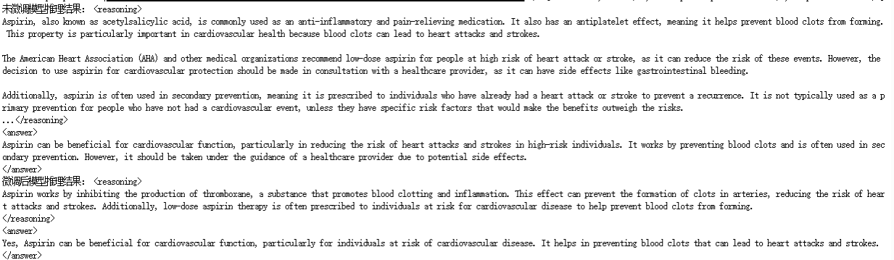
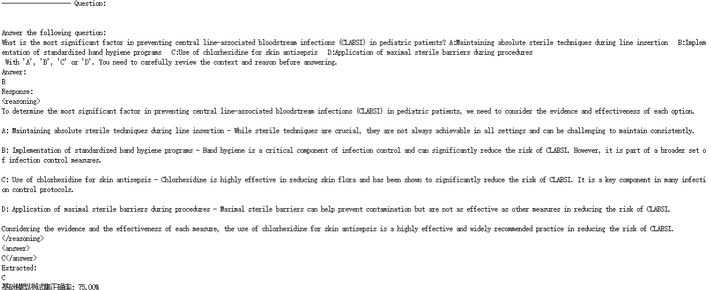
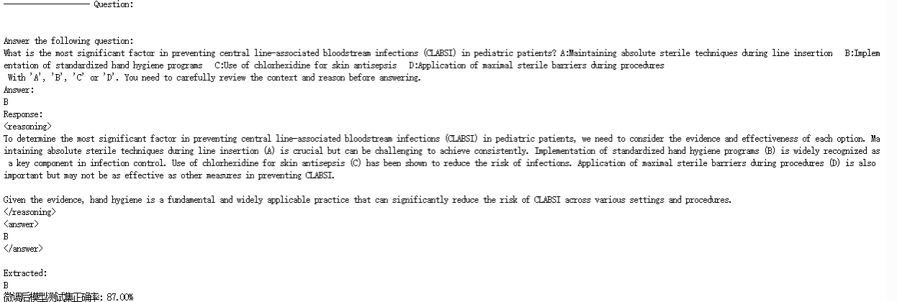

# Qwen2.5GRPO

基于Unsloth和TRL库，使用GRPO算法对Qwen2.5-7B-Instruct进行多领域推理能力的微调。项目整合了数学推理和部分医学数据集，包括GSM8K数学推理、PubMedQA医学问答和Health Benchmarks医学多选题，通过多奖励函数优化模型在数学和医学领域的推理和回答能力。

## 数据集说明

### GSM8K
- **类型**: 数学推理问题
- **格式**: 数值答案
- **用途**: 训练数学推理能力

### PubMedQA
- **类型**: 医学文献问答
- **格式**: Yes/No/Maybe答案
- **用途**: 训练医学文献理解能力

### Health Benchmarks
- **类型**: 医学多选题
- **格式**: A/B/C/D选项
- **用途**: 训练医学知识应用能力

## 自定义奖励函数说明，用于多维度优化模型输出：

1. **correctness_reward_func**: 答案正确性奖励
2. **int_reward_func**: 答案格式正确性奖励
3. **strict_format_reward_func**: 严格格式检查奖励
4. **soft_format_reward_func**: 宽松格式检查奖励
5. **xmlcount_reward_func**: XML标签计数奖励
6. **safety_reward_func**: 安全性检查奖励（防止危险医学建议）

## 输出格式

模型被训练为使用以下XML格式输出：

```xml
<reasoning>
推理过程...
</reasoning>
<answer>
最终答案
</answer>
```

## 环境配置

```bash
conda create -n grpo python=3.10.18 -y
conda activate grpo
pip install -r requirements.txt
```

##训练流程

### 1. 首次运行需自动下载和处理数据集：

```bash
python data_process.py
```

### 2. 直接运行train.py，也可自动处理数据：

```bash
python train.py
```

### 3. 模型推理

```bash
python inference.py
```



*上图展示了微调前后模型在同一问题上的推理结果对比。可以看出，微调后的模型推理能力明显增强，回答更加明确、专业。*

### 4. 模型评估

在模型评估阶段，我们设置了简易模型评估，针对测试集的前100条数据，采用回答正确与否对微调前后模型进行对比：

<div style="display: flex; gap: 20px; align-items: flex-start;">
  <div>
    
    <p align="center">微调前结果</p>
  </div>
  <div>
    
    <p align="center">微调后结果</p>
  </div>
</div>

*如上图所示，微调后模型在医学问题上的正确率有所上升，能够给出更加准确、专业的回答。*

## 常见问题

1. **显存不足**:
   - 减少`max_seq_length`
   - 降低`lora_rank`
   - 使用更小的模型

2. **数据集/模型下载失败**:
   - 检查网络连接
   - 使用代理或镜像源
